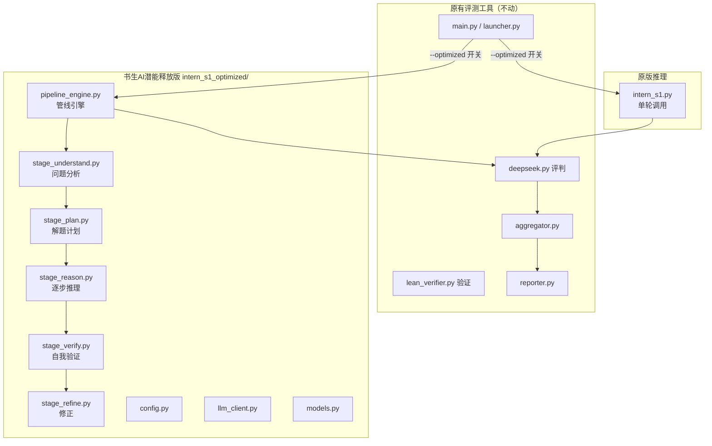

## 用户需求

在 d:\挑战杯\ 项目下创建独立子目录 `intern_s1_optimized/`，作为「书生AI潜能释放版」。将现有 Intern-S1 推理模块独立复制出来，原测试工具不动。在此基础上优化推理策略，然后用原有测试工具对比优化前后的正确率。

## 产品概述

一个独立的 Intern-S1 数学智能体优化模块，实现多轮推理管线（问题分析→制定计划→逐步推理→自我验证→修正），通过思维链增强、自我验证与修正等策略提升数学解题正确率。优化后的模块保持与原有评测工具的接口兼容，可通过配置开关在优化版和原版之间切换。

## 核心功能

- **独立模块架构**：创建 `intern_s1_optimized/` 独立子目录，完整复制书生AI推理核心（intern_s1.py、llm_client.py、config.py、models.py），原测试工具零修改
- **多轮推理管线**：实现「问题分析 → 解题计划 → 逐步推理 → 自我验证 → 修正」的多阶段推理流程，替代原有单轮调用
- **思维链增强**：每阶段使用针对性的 System Prompt，引导模型显式展示完整推理过程
- **自我验证与修正**：推理完成后让模型自我检查答案正确性，发现问题时自动修正
- **接口兼容**：对外暴露 `run_inference(problem: Problem) -> InferenceResult` 完全相同的函数签名，返回相同数据模型
- **策略可配置**：支持通过参数控制推理轮次、是否启用验证、温度等参数
- **对比评测**：修改 main.py 增加 `--optimized` 开关，可一键切换优化版/原版进行正确率对比

## 技术栈

- **语言**：Python 3.10+
- **异步框架**：asyncio + httpx（异步 HTTP 客户端）
- **数据模型**：Python dataclass（与现有 models.py 完全兼容）
- **配置管理**：python-dotenv + 环境变量
- **依赖**：复用现有 requirements.txt（httpx, python-dotenv）

## 实现方案

### 整体策略

采用**管线模式（Pipeline Pattern）**组织多轮推理流程。每一轮是一个独立的推理阶段，有专门的 System Prompt 和解析逻辑。各阶段通过数据类传递中间结果，最终合并为与原有 `InferenceResult` 完全兼容的输出。

核心思路：将原有的「一次API调用出结果」升级为「多阶段管线式推理」，每个阶段调用一次 Intern-S1 API，但每阶段有明确的分工。

### 推理管线设计

```
输入: Problem
    │
    ▼
阶段1: 问题理解与分析 (understand)
    │  理解题意、识别题型、提取关键条件
    │  Prompt: "You are a math problem analyst..."
    │  → analysis: str
    ▼
阶段2: 解题计划制定 (plan)
    │  制定分步解题策略、选择定理/公式
    │  Prompt: "Based on the analysis, create a step-by-step plan..."
    │  → plan: list[str]
    ▼
阶段3: 逐步推理求解 (reason)
    │  按计划逐步推理、计算、推导
    │  Prompt: "Follow the plan and solve step by step..."
    │  → answer, reasoning, steps
    ▼
阶段4: 自我验证 (verify)
    │  检查推理逻辑、验算答案、发现潜在错误
    │  Prompt: "Verify the solution. Check each step..."
    │  → verification, issues_found: list
    ▼
阶段5: 修正（条件触发）(refine)
    │  仅在验证发现问题时执行，修正错误并重新输出
    │  Prompt: "The verification found issues. Fix them..."
    │  → corrected_answer, corrected_reasoning
    ▼
输出: InferenceResult（合并各阶段结果）
```

### 关键设计决策

1. **管线 vs 单轮多步骤 Prompt**：选择多轮API调用而非一个超长Prompt。理由是：(a) 每阶段上下文更聚焦，避免模型注意力分散；(b) 每阶段可独立调试和优化；(c) 符合赛题「不鼓励仅通过提示词堆叠」的要求；(d) 代价是API调用次数增加，但每阶段可用更短的max_tokens。

2. **修正阶段条件触发**：仅在阶段4发现明显问题时触发修正，避免不必要的API调用。判断标准：verification 中包含"错误/error/mistake/wrong/incorrect"等关键词，或答案不一致。

3. **降级策略**：如果某阶段API调用失败，使用回退值继续管线，确保不阻塞整体流程。最终返回 InferenceResult 时标记 error 字段。

4. **接口兼容性**：`run_inference(problem)` 签名不变，内部实现可选管线模式。新增 `run_inference_optimized(problem, strategy="pipeline")` 作为扩展入口。

### 与现有评测工具的集成方式

修改 `测试工具/main.py` 的 import 逻辑：

- 默认导入 `测试工具/intern_s1.py`（原版）
- 当 `--optimized` 参数启用时，将 `intern_s1_optimized/` 加入 sys.path，导入优化版 `run_inference`
- 测试工具其他代码（deepseek.py、lean_verifier.py 等）完全不感知变化，因为它们只依赖 `InferenceResult` 数据结构

## 实现细节

### 性能考量

- 多轮管线API调用次数增加（最坏5次 vs 原1次），但每阶段 max_tokens 可降低（如 1024-2048），总体token消耗可控
- 阶段间使用 asyncio 串行执行（下一阶段依赖上一阶段结果），不需要并发
- 修正阶段条件触发，正常情况只需4轮
- 总体延迟增加约3-4倍，但正确率提升是赛题核心目标

### 日志与调试

- 复用现有 logging 模块，每阶段记录耗时和token消耗
- 管线中间结果写入 InferenceResult.raw_response（可包含多阶段信息）
- 不记录 API Key 等敏感信息

### 向后兼容

- `intern_s1_optimized/` 是完全独立的目录，不影响现有代码
- `main.py` 仅增加一行 import 条件分支，不修改原有逻辑
- 原 `run_inference` 行为完全保留

## 架构设计

### 系统架构图



### 模块职责

| 模块 | 文件 | 职责 |
| --- | --- | --- |
| 管线引擎 | pipeline_engine.py | 编排多阶段流程，管理中间状态，降级处理 |
| 阶段1 | stage_understand.py | 问题理解：识别题型、提取条件 |
| 阶段2 | stage_plan.py | 制定解题计划：选择方法、分解步骤 |
| 阶段3 | stage_reason.py | 逐步推理：按计划求解，输出答案 |
| 阶段4 | stage_verify.py | 自我验证：检查逻辑、验算答案 |
| 阶段5 | stage_refine.py | 修正：根据验证结果修正错误 |
| 入口 | intern_s1.py | 对外统一入口，保持 run_inference 签名 |
| 客户端 | llm_client.py | 复用原版 LLMClient（独立副本） |
| 配置 | config.py | 复用原版配置结构，增加管线参数 |
| 数据模型 | models.py | 复用原版数据模型，增加管线中间状态 |


## 目录结构

```
d:\挑战杯\
├── intern_s1_optimized/              # [NEW] 书生AI潜能释放版（独立子目录）
│   ├── __init__.py                   # [NEW] 包初始化，导出 run_inference
│   ├── intern_s1.py                  # [NEW] 统一入口模块
│   │                                  # 对外暴露 run_inference(problem) -> InferenceResult
│   │                                  # 内部根据策略参数选择单轮/管线模式
│   │                                  # 签名与原版完全一致，保持接口兼容
│   ├── pipeline_engine.py            # [NEW] 管线引擎
│   │                                  # PipelineEngine 类：编排多阶段流程
│   │                                  # 管理 PipelineState 中间状态
│   │                                  # 处理阶段异常降级、修正条件触发
│   │                                  # 合并各阶段结果为 InferenceResult
│   ├── stage_understand.py           # [NEW] 阶段1：问题理解与分析
│   │                                  # 构建分析型 System Prompt
│   │                                  # 调用 LLM 识别题型、提取关键条件
│   │                                  # 输出：analysis_text, problem_type, key_conditions
│   ├── stage_plan.py                 # [NEW] 阶段2：解题计划制定
│   │                                  # 基于阶段1分析结果构建计划 Prompt
│   │                                  # 引导模型选择定理/公式、分解步骤
│   │                                  # 输出：plan_steps (list[str])
│   ├── stage_reason.py               # [NEW] 阶段3：逐步推理求解
│   │                                  # 按计划逐步推理，结构化输出
│   │                                  # 输出：answer, reasoning, steps, raw_json
│   ├── stage_verify.py               # [NEW] 阶段4：自我验证
│   │                                  # 验证 Prompt：逐步骤检查、验算答案
│   │                                  # 输出：verification_text, issues_found, is_confident
│   ├── stage_refine.py               # [NEW] 阶段5：修正（条件触发）
│   │                                  # 仅在验证发现问题时调用
│   │                                  # 根据 issues 修正推理和答案
│   │                                  # 输出：corrected_answer, corrected_reasoning
│   ├── llm_client.py                 # [NEW] LLM 客户端（独立副本）
│   │                                  # 从 测试工具/llm_client.py 完整复制
│   │                                  # LLMClient 类 + extract_json_from_text 函数
│   │                                  # 与原版保持功能一致
│   ├── config.py                     # [NEW] 配置管理（独立副本 + 扩展）
│   │                                  # 从 测试工具/config.py 复制基础部分
│   │                                  # 新增：PipelineConfig 数据类（控制管线参数）
│   │                                  #   - enable_pipeline: bool（是否启用管线）
│   │                                  #   - enable_verify: bool（是否启用验证）
│   │                                  #   - enable_refine: bool（是否启用修正）
│   │                                  #   - stage_temperatures: dict（各阶段温度）
│   │                                  #   - stage_max_tokens: dict（各阶段max_tokens）
│   ├── models.py                     # [NEW] 数据模型（独立副本 + 扩展）
│   │                                  # 从 测试工具/models.py 复制基础数据类
│   │                                  # 新增：PipelineState（管线中间状态）
│   │                                  #   - analysis, plan, reasoning_result, verification
│   │                                  # 保持 Problem、InferenceResult 完全兼容
│   └── .env.example                  # [NEW] 配置示例文件
│
├── 测试工具/                          # 原有评测工具（仅小幅修改）
│   └── main.py                       # [MODIFY] 增加 --optimized 开关
│                                      #   添加命令行参数 --optimized
│                                      #   当启用时，将 intern_s1_optimized/ 加入 sys.path
│                                      #   导入优化版 run_inference 替代原版
│                                      #   其余评测逻辑完全不变
```

## 关键代码结构

### PipelineState 数据类（新增）

```python
@dataclass
class PipelineState:
    """管线中间状态，在各阶段间传递"""
    problem_id: str
    question: str
    # 阶段1输出
    analysis: str = ""
    problem_type: str = ""
    key_conditions: list = field(default_factory=list)
    # 阶段2输出
    plan_steps: list = field(default_factory=list)
    # 阶段3输出
    answer: str = ""
    reasoning: str = ""
    steps: list = field(default_factory=list)
    raw_reasoning_json: dict = field(default_factory=dict)
    # 阶段4输出
    verification: str = ""
    issues_found: list = field(default_factory=list)
    is_confident: bool = True
    # 阶段5输出（条件触发）
    refined_answer: str = ""
    refined_reasoning: str = ""
    # 累计指标
    total_tokens: int = 0
    total_latency: float = 0.0
    stage_errors: list = field(default_factory=list)
```

### PipelineConfig 数据类（新增）

```python
@dataclass
class PipelineConfig:
    """管线策略配置"""
    enable_pipeline: bool = True       # 是否启用多轮管线
    enable_verify: bool = True         # 是否启用自我验证阶段
    enable_refine: bool = True         # 是否启用修正阶段（依赖验证结果）
    stage_temperatures: dict = field(default_factory=lambda: {
        "understand": 0.3,
        "plan": 0.3,
        "reason": 0.3,
        "verify": 0.2,
        "refine": 0.2,
    })
    stage_max_tokens: dict = field(default_factory=lambda: {
        "understand": 1024,
        "plan": 1024,
        "reason": 3072,
        "verify": 1536,
        "refine": 2048,
    })
```

## Agent Extensions

### SubAgent

- **code-explorer**
- Purpose: 在创建独立模块时，需要精确复制 `测试工具/llm_client.py`、`测试工具/config.py`、`测试工具/models.py` 的内容和依赖关系，确保独立模块能自包含运行
- Expected outcome: 确认所有需要复制的文件的完整依赖链，确保 intern_s1_optimized/ 目录下的文件相互引用正确，不依赖测试工具/下的任何模块

### Skill

- **code-quality**
- Purpose: 在实现多阶段管线代码时，确保代码符合项目代码规范（代码要求.txt），包括中文注释、命名规范、模块职责单一等
- Expected outcome: 所有新文件符合 PEP8 规范，包含完整中文 docstring，模块间低耦合高内聚

- **提示词工程专家**
- Purpose: 优化各阶段的 System Prompt，使每个阶段的 Prompt 精准、高效，引导 Intern-S1 输出结构化且高质量的推理结果
- Expected outcome: 5个阶段的 System Prompt 经过专业优化，每个 Prompt 职责明确、输出格式清晰、对模型的引导精准