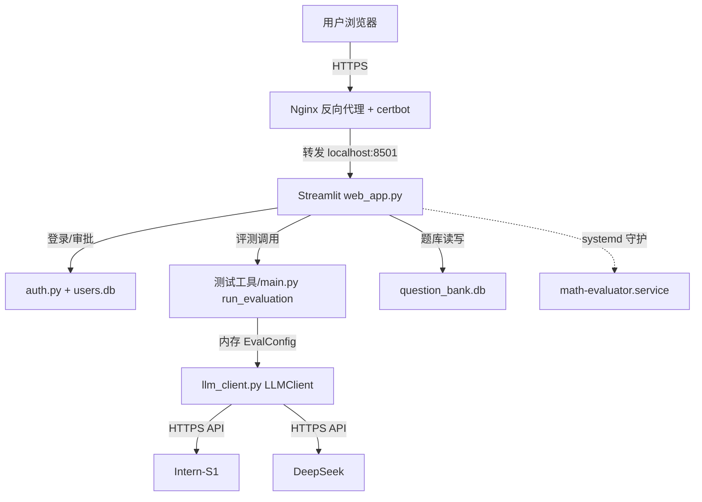

## 用户需求

将本地的「数学智能体评测器」Python 项目部署到云服务器，让其他人可通过网站使用。

## 产品概述

在 500 元预算内，选购轻量云服务器 + 域名 + HTTPS 证书，将现有评测工具包装为 Streamlit 网页应用。访问方式为内部测试：用户需注册账户，由本人审批通过后方可使用；后续可切换为公开访问。评测所需的 Intern-S1 / DeepSeek API Key 由访客在网页自行填写，各自消耗各自额度，服务端不统一存储 Key。

## 核心功能

- 账户注册与审批：用户注册后状态为"待审批"，管理员在后台批准后才能登录使用；预留"开放公开注册"开关供后续切换。
- 网页评测：支持上传 PDF/Word/PPT/JSON/CSV 等文件，填写自己的双 API Key，一键触发评测，后台运行并实时展示进度。
- 报告展示：评测完成后在线展示 HTML 可视化报告（准确率、分领域统计、逐题详情）。
- 题库管理：复用现有 SQLite 题库，支持创建题库、查看题目、随机选题评测。
- 便捷更新：项目持续迭代，部署架构支持 git pull + 重启即可更新，含一键更新脚本。
- 安全访问：Nginx 反向代理 + Let's Encrypt 免费 HTTPS，保障传输安全。

## 技术栈选型

- Web 框架：Streamlit（用户指定，纯 Python，复用现有 测试工具/ 模块，无需前端开发）
- 鉴权：streamlit-authenticator（登录会话管理）+ 自建 SQLite 账户表（含审批状态）
- 服务器：Ubuntu 22.04 轻量应用服务器（2核4G），Nginx 反向代理，systemd 进程守护，certbot 免费 HTTPS
- 语言/运行时：Python 3.10+（与现有项目一致）
- 数据库：SQLite（复用 question_bank.db，新建 users.db）

## 实现方案

### 高层策略

新建 `web_app.py` 作为 Streamlit 入口，直接复用 `测试工具/main.py` 中已封装的 `run_evaluation()` 流水线（其已预留 `progress_callback` 参数，当前未使用），不改动核心评测逻辑。访客填写的 API Key 在内存中构造 `EvalConfig` 实例（沿用 `config.py` 的 `LLMConfig`/`EvalConfig` 数据结构），通过 `LLMClient` 使用，绝不落盘。长任务用后台线程执行 `asyncio.run(run_evaluation(...))`，主线程轮询 `st.session_state` 展示进度，避免 UI 阻塞。

### 关键技术决策

1. **复用而非重写**：`run_evaluation` 已是验证过的完整流水线入口，Web 层只做"参数准备 + 回调接进度条 + 后台线程"，零侵入核心逻辑，降低回归风险。
2. **API Key 内存化**：不调用 `save_config()`（会写入 `~/.math_evaluator/.env`），而是直接构造 `EvalConfig(intern_s1=LLMConfig(api_key=...,...), deepseek=LLMConfig(...))` 传入评测函数，天然满足"访客自己填 Key、不落盘"需求。
3. **审批式鉴权**：采用 `auth.py` + `users.db`（SQLite），账户状态 `pending/approved/rejected`，管理员通过简单后台页面或脚本审批；用 `ALLOW_PUBLIC` 环境变量控制是否开放注册，便于未来切换公开。
4. **进程守护与更新**：systemd 守护 Streamlit 进程（崩溃自启）；更新只需 `git pull && pip install -r requirements.txt && systemctl restart`，提供 `deploy/update.sh` 一键脚本，契合"频繁更新"诉求，避免过度复杂的容器编排。

### 性能与可靠性

- 评测为长任务（63s/题），后台线程 + 轮询避免 Streamlit 单线程阻塞；progress_callback 按 (current, total) 驱动 `st.progress`，O(1) 更新开销。
- 内部测试期并发用户少（<10），SQLite 读写无瓶颈；共享 question_bank.db 用 WAL 模式（现有已配置），读写互不阻塞。
- 风险：Streamlit 多用户共享进程内存，并发评测可能互相影响；初期内部测试可接受，后续可加任务队列隔离。

## 实现注意事项

- **复用现有模式**：`main.py` 的 `auto_convert` / `run_evaluation` / `run_evaluation_from_bank` 直接复用；`question_bank.py` 的 `QuestionBankDB` 直接复用。不要为 Web 重写评测逻辑。
- **进度回调接入**：`run_evaluation` 当前的 `progress_callback` 参数标注"暂未使用"，需在 `evaluate_batch_mode` 中补充对 `progress_callback(current, total)` 的实际调用（小改动，约 10 行），供 Web 进度条使用；保持 CLI 调用不受影响（callback 为 None 时跳过）。
- **Key 不落盘**：严禁在 Web 路径调用 `save_config()` 或写入任何含 Key 的文件/数据库字段；仅存 `st.session_state`。
- **日志**：复用项目 `logging` 模块，评测日志输出到服务端文件（非终端），避免泄露 Key（日志中 Key 需脱敏）。
- **爆炸半径控制**：不修改 `测试工具/` 下除 `progress_callback` 接入外的任何逻辑；新增文件集中在根目录 `web_app.py`、`auth.py`、`deploy/`。

## 架构设计

### 系统架构图



### 模块关系

- `web_app.py`：顶层编排，负责鉴权门禁、页面路由、文件上传、Key 输入、触发后台评测、报告展示、题库管理 UI。
- `auth.py`：独立鉴权模块，管理 users.db 的注册/登录/审批，对外暴露 `login()`、`register()`、`approve_user()`、`is_approved()` 接口。
- `测试工具/`（复用）：评测核心，`web_app.py` 仅通过 `run_evaluation` 与其交互。

## 目录结构

```
挑战杯/
├── web_app.py                     # [NEW] Streamlit 入口。实现登录/注册/审批门禁 + 三大页面（快速评测、题库管理、题库浏览）；上传文件转临时JSON；用访客Key构造内存EvalConfig；后台线程调用run_evaluation；进度轮询；HTML报告展示。
├── auth.py                        # [NEW] 账户鉴权模块。SQLite users.db（username, password_hash, status, created_at）；register/login/approve_user/list_pending 函数；集成 streamlit-authenticator；ALLOW_PUBLIC 开关。
├── deploy/
│   ├── nginx.conf                 # [NEW] Nginx 反向代理配置模板，含 HTTPS 跳转与可选限流。
│   ├── math-evaluator.service     # [NEW] systemd 单元文件，守护 streamlit 进程。
│   ├── update.sh                  # [NEW] 一键更新脚本：git pull + 装依赖 + 重启服务。
│   └── DEPLOY_GUIDE.md            # [NEW] 端到端部署文档：购机、装环境、部署、HTTPS、更新。
├── requirements.txt               # [MODIFY] 追加 streamlit>=1.30、streamlit-authenticator>=0.3.0。
└── 测试工具/
    └── main.py                    # [MODIFY] 在 evaluate_batch_mode / _run_single_mode 中接入 progress_callback 实际调用（约10行），不影响 CLI 默认行为。
```

## 设计风格

本任务以功能部署为主，Web 界面使用 Streamlit 默认组件 + 轻量自定义 CSS，风格采用简洁专业的科技蓝调，突出评测报告的数据可视化。不做复杂前端设计，保持 Streamlit 原生组件的可维护性与快速迭代能力。

## 页面规划（3 个核心页面 + 鉴权门禁）

1. **登录/注册页**：用户名密码输入、注册申请、待审批提示。
2. **快速评测页**：文件上传区、双 API Key 输入、并发数设置、评测进度条、报告展示区。
3. **题库管理页**：题库列表、创建/删除、随机选题评测、题目浏览。

## 交互说明

- 登录后显示侧边栏导航（Streamlit 原生 sidebar）。
- 评测中显示 `st.progress` 进度条 + `st.status` 运行状态文本。
- 报告完成后用 `st.download_button` 提供 HTML 下载，并用 `st.components.v1.html` 内嵌预览。
- 管理员在登录页下方提供"审批后台"入口（仅 approved 管理员可见）。

## Agent Extensions

### Skill

- **devops-automation**
- 用途：指导服务器部署、Nginx 配置、systemd 服务、HTTPS 证书申请的 DevOps 最佳实践。
- 预期结果：生成可靠的 nginx.conf、systemd 服务文件、update.sh 及部署文档，避免常见部署坑。
- **coding**
- 用途：确保 web_app.py、auth.py 及 main.py 改动遵循代码质量与软件工程原则（SOLID、错误处理、不重复造轮子）。
- 预期结果：Web 层代码高质量、复用现有模块、改动最小化且可维护。