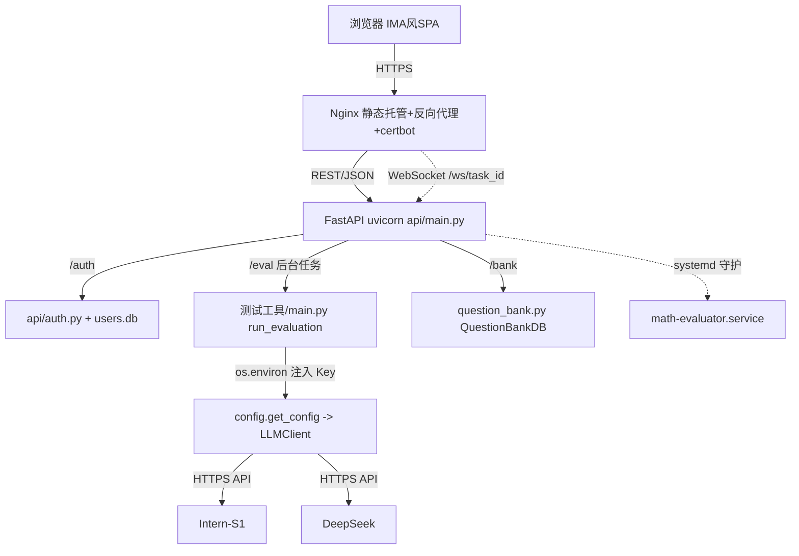

## 用户需求

将本地的「数学智能体评测器」（优化版书生 AI）部署到云服务器，让他人通过网站使用。

## 产品概述

在 500 元预算内选购轻量云服务器 + 域名 + HTTPS 证书，把现有 Python 评测工具包装为「模仿腾讯 IMA（ima.copilot）风格的 Web 应用」。采用**自定义前端（HTML/CSS/JS + Tailwind）+ FastAPI 后端**架构，高度还原 IMA 的精致观感。访问方式为内部测试：用户注册账户后需本人审批通过才能使用，后续可切换为公开访问。评测所需的 Intern-S1 / DeepSeek API Key 由访客在网页自行填写，各自消耗各自额度，服务端不统一存储 Key。

## 核心功能

- 账户注册与审批：用户注册后状态为「待审批」，管理员在后台批准后才能登录使用；预留「开放公开注册」开关供后续切换为公开。
- 网页评测：支持上传 PDF/Word/PPT/JSON/CSV 等文件，填写自己的双 API Key 与并发数，一键触发评测；后台运行并通过 WebSocket 实时展示进度。
- 报告展示：评测完成后在线嵌入预览 HTML 可视化报告（准确率、分领域统计、逐题详情），并提供下载。
- 题库管理：复用现有 SQLite 题库，支持创建/删除题库、查看题目、随机选题评测。
- 便捷更新：项目持续迭代，部署架构支持 git pull + 重启即可更新，含一键更新脚本。
- 安全访问：Nginx 反向代理 + Let's Encrypt 免费 HTTPS，保障传输安全；API Key 仅存于内存、绝不落盘。

## 设计风格要求

- 关键词：简洁、科技蓝、数据可视化、专业；还原腾讯 IMA 界面（左侧导航侧边栏、卡片式内容、浅色背景 + 蓝色点缀、流畅微交互）。
- 配色：主色 #1E88E5 / #1565C0；背景 #F5F7FA / #FFFFFF；文字 #212121 / #616161；功能色 绿 #4CAF50、红 #F44336、橙 #FF9800。
- 字体：Microsoft YaHei；标题 24px/600，副标题 16px/500，正文 14px/400。
- 必须体现 rich aesthetics、微动画（hover/过渡）、渐变与 premium 质感。

## 技术栈选型

- 后端框架：FastAPI + uvicorn（Python 3.10+，与现有项目一致）
- 鉴权：JWT（python-jose[cryptography]）+ 密码哈希（passlib[bcrypt]）
- 前端：HTML5 + Tailwind CSS（CDN）+ 原生 JS（fetch + WebSocket），纯静态文件由 Nginx 托管
- 数据库：SQLite（复用 `测试工具/question_bank.db`，新建 `api/users.db` 账户表）
- 服务器：Ubuntu 22.04 轻量应用服务器（2核4G），Nginx 反向代理，systemd 守护，certbot 免费 HTTPS

## 实现方案

### 高层策略

新建 `api/` 作为 FastAPI 后端，直接复用 `测试工具/main.py` 的 `run_evaluation()` / `run_evaluation_from_bank()` 流水线（已封装完整推理+评判+报告生成），不改动核心评测逻辑。访客填写的 API Key 在后端评测后台任务中通过 `os.environ` 注入（`get_config()` 每次调用都从环境变量重新构造 `EvalConfig`，未缓存值），评测结束后清理，**绝不写入文件/数据库/日志**，天然满足「访客自填 Key、不落盘」。评测为长任务（平均推理 63s/题），用 asyncio 后台任务执行，经 WebSocket 向前端推送 `(current, total, status)` 进度。

### 关键技术决策

1. **复用而非重写**：`run_evaluation` 已是验证过的完整流水线入口，后端只做「参数准备 + 环境注入 + 进度回调 + WebSocket 推送」，零侵入核心逻辑，降低回归风险。
2. **Key 内存化（经环境变量注入）**：因 `intern_s1.py`/`deepseek.py` 内部通过 `config.get_config()` 读取全局配置（来自 `os.getenv`），后端在每次评测后台任务开始时设置 `os.environ["INTERN_S1_API_KEY"]` / `os.environ["DEEPSEEK_API_KEY"]`，任务结束清理；配合**全局 asyncio.Lock 串行化评测**避免并发串号。内部测试期用户少（<10），串行可接受，后续可升级为按任务透传 cfg。
3. **审批式鉴权**：`api/users.py` 管理 `users.db`（username, password_hash, status[pending/approved/rejected], is_admin, created_at）；`api/auth.py` 提供注册、登录(JWT)、审批、待审列表；`ALLOW_PUBLIC` 环境变量控制是否开放注册，便于未来切换公开。
4. **WebSocket 实时进度**：前端连 `/ws/{task_id}`，后端在 `run_evaluation` 的 `progress_callback` 中推送；评测完成推送报告 HTML 或路径，前端用 iframe/blob 预览 + 下载按钮。
5. **进程守护与更新**：systemd 守护 uvicorn 进程（崩溃自启）；更新只需 `git pull && pip install -r requirements.txt && systemctl restart`，提供 `deploy/update.sh` 一键脚本，契合「频繁更新」诉求。

### 性能与可靠性

- 评测长任务：后台 asyncio 任务 + WebSocket 推送，O(1) 进度更新开销，前端无阻塞。
- 内部测试期并发用户少（<10），SQLite 读写无瓶颈；共享 `question_bank.db` 已用 WAL 模式，读写互不阻塞。
- 评测串行锁避免多用户 Key 互相覆盖；风险：单进程串行评测吞吐有限，初期内部测试可接受，后续可加任务队列/多 worker 隔离。
- 日志复用项目 `logging`，评测日志输出服务端文件，Key 脱敏。

### 实现注意事项

- **复用现有模式**：`main.py` 的 `auto_convert` / `run_evaluation` / `run_evaluation_from_bank`、`question_bank.py` 的 `QuestionBankDB` 直接复用，不为 Web 重写评测逻辑。
- **进度回调接入**：`run_evaluation` 已有的 `progress_callback` 参数需向 `evaluate_batch_mode` / `_run_single_mode` 透传，并在推理阶段逐题上报进度（约 10-20 行）；`callback` 为 `None` 时跳过，不影响 CLI 默认行为。
- **Key 不落盘**：严禁在 Web 路径调用 `save_config()` 或写入任何含 Key 的文件/数据库字段/日志。
- **爆炸半径控制**：不修改 `测试工具/` 下除 `progress_callback` 接入与（可选的）`run_evaluation_from_bank` 透传外的任何逻辑；新增文件集中在 `frontend/`、`api/`、`deploy/`。

## 架构设计



### 模块关系

- `api/main.py`：顶层入口，聚合路由，开发期托管前端静态文件 + CORS。
- `api/evaluate.py`：评测接口，接收文件+Key+并发数，后台 asyncio 任务调 `run_evaluation`，经 WebSocket 推送进度，结束后返回/写入报告。
- `api/auth.py` + `api/users.py`：注册/登录/审批，JWT 签发与校验。
- `frontend/`：IMA 风格界面，登录注册门禁 + 侧边栏导航（快速评测/题库管理/报告）+ 评测与进度交互。

## 目录结构

```
挑战杯/
├── frontend/
│   ├── index.html              # [NEW] IMA 风格主壳：登录/注册门禁 + 侧边栏导航 + 三页（快速评测/题库管理/报告）。Tailwind CDN，语义化结构。
│   ├── css/style.css           # [NEW] 自定义 IMA 风格：左侧玻璃拟态侧边栏、卡片、蓝色渐变按钮、hover 微动效、浅灰背景。
│   └── js/
│       ├── api.js              # [NEW] 封装 fetch/JWT 与 WebSocket 连接工具。
│       ├── auth.js             # [NEW] 登录/注册/审批后台交互与令牌管理。
│       ├── eval.js             # [NEW] 文件上传+双Key输入+评测触发+WebSocket进度条+报告 iframe 预览/下载。
│       └── bank.js             # [NEW] 题库列表/创建/删除/随机选题评测交互。
├── api/
│   ├── main.py                 # [NEW] FastAPI 入口，聚合路由，静态托管与 CORS。
│   ├── config.py               # [NEW] 服务端配置（SECRET_KEY、ALLOW_PUBLIC、管理员初始账号、CORS 白名单）。
│   ├── schemas.py              # [NEW] Pydantic 模型（Register/Login/EvalRequest/BankCreate 等）。
│   ├── users.py                # [NEW] users.db 初始化与 CRUD（注册/校验密码/改状态/管理员判定）。
│   ├── auth.py                 # [NEW] 注册、登录签发 JWT、审批、待审列表、当前用户。
│   ├── evaluate.py             # [NEW] 上传文件+Key+并发数 → 后台任务调 run_evaluation；WebSocket 进度；报告返回。
│   └── bank.py                 # [NEW] 题库接口：列表/创建/删除/随机选题（复用 QuestionBankDB）。
├── deploy/
│   ├── nginx.conf              # [NEW] 静态前端托管 + /api 与 /ws 反向代理 + HTTPS 跳转 + 可选限流。
│   ├── math-evaluator.service  # [NEW] systemd 单元，守护 uvicorn。
│   ├── update.sh               # [NEW] 一键更新：git pull + 装依赖 + 重启服务。
│   └── DEPLOY_GUIDE.md         # [NEW] 端到端部署文档：购机、装环境、部署、HTTPS、更新、上线检查。
├── requirements.txt            # [MODIFY] 追加 fastapi、uvicorn、python-jose[cryptography]、passlib[bcrypt]、python-multipart。
└── 测试工具/
    └── main.py                 # [MODIFY] 向 evaluate_batch_mode/_run_single_mode 透传 progress_callback 并接入实际调用（约10-20行），不影响 CLI。
```

## 关键代码结构

```python
# api/evaluate.py 评测入口（示意签名，实现由子代理细化）
@router.post("/eval/start")
async def start_eval(file: UploadFile, intern_key: str, deepseek_key: str,
                     concurrency: int = 3, bank_name: str = None,
                     user = Depends(get_current_user)) -> dict:
    """保存上传文件为临时 JSON，启动后台 asyncio 任务，返回 task_id。"""

@router.websocket("/ws/{task_id}")
async def eval_progress(ws: WebSocket, task_id: str):
    """推送 {"current":int,"total":int,"status":str,"report_html":str|null}。"""

# 配置注入（在后台任务内）
import os
os.environ["INTERN_S1_API_KEY"] = intern_key   # 任务开始注入，结束 del
os.environ["DEEPSEEK_API_KEY"] = deepseek_key
html_path = await run_evaluation(tmp_path, concurrency=concurrency,
                                 progress_callback=ws_push, bank_name=bank_name)
```

## 设计风格

采用「腾讯 IMA（ima.copilot）风格 + 科技蓝」的专业生产力工具界面，使用 HTML5 + Tailwind CSS（CDN）+ 原生 JS 实现，纯静态文件由 Nginx 托管。整体浅色干净背景（#F5F7FA），左侧固定玻璃拟态侧边栏（logo「优化版书生 AI」+ 导航：快速评测 / 题库管理 / 报告），主区顶部标题栏 + 卡片式内容区。强调蓝色渐变按钮、卡片阴影/圆角、hover 微动效与流畅过渡，体现 premium 质感与数据可视化重点。

## 页面规划（3 个核心页面 + 登录门禁）

1. **登录 / 注册页**：居中卡片，蓝色渐变标题，用户名/密码输入，注册申请按钮，待审批提示；管理员可见「审批后台」入口。
2. **快速评测页**：卡片式上传区（拖放 + 点击）、双 API Key 输入（密码框）、并发数滑块、渐变「开始评测」按钮；评测中显示自定义蓝色进度条 + 状态文本；完成后 iframe 内嵌 HTML 报告 + 下载按钮。
3. **题库管理页**：卡片网格列出题库（名称/题数），创建/删除操作，随机选题评测入口，题目列表浏览。

## 交互说明

- 左侧固定侧边栏导航，主区随选中切换，顶部标题栏显示当前页与用户信息。
- 评测进度条基于 WebSocket 实时更新，带平滑过渡动画；状态文本提示「推理中 / 评判中 / 完成」。
- hover 时卡片轻微上浮 + 阴影加深；按钮渐变 + 按下反馈。
- 报告以 iframe 内嵌预览，右上角「下载 HTML」按钮。

## Agent Extensions

### Skill

- **前端开发**
- 用途：构建 IMA 风格的 premium 前端界面（HTML/Tailwind/原生 JS），包含精致布局、微动画与数据可视化呈现。
- 预期结果：产出视觉精致、交互流畅、高度还原 IMA 观感的 `frontend/` 静态站点。
- **SuperDesign**
- 用途：提供现代 UI 设计准则，指导前端视觉与交互细节（配色、排版、卡片、动效）。
- 预期结果：前端设计符合 rich aesthetics 与 premium 质感要求，风格系统一致。
- **devops-automation**
- 用途：指导服务器部署、Nginx 配置、systemd 服务、HTTPS 证书申请的 DevOps 最佳实践。
- 预期结果：生成可靠的 nginx.conf、systemd 服务文件、update.sh 及部署文档，规避常见部署坑。
- **coding**
- 用途：确保 `api/` 后端与 `main.py` 改动遵循软件工程原则（SOLID、错误处理、不重复造轮子、Key 不落盘）。
- 预期结果：后端代码高质量、复用现有模块、改动最小化且可维护。