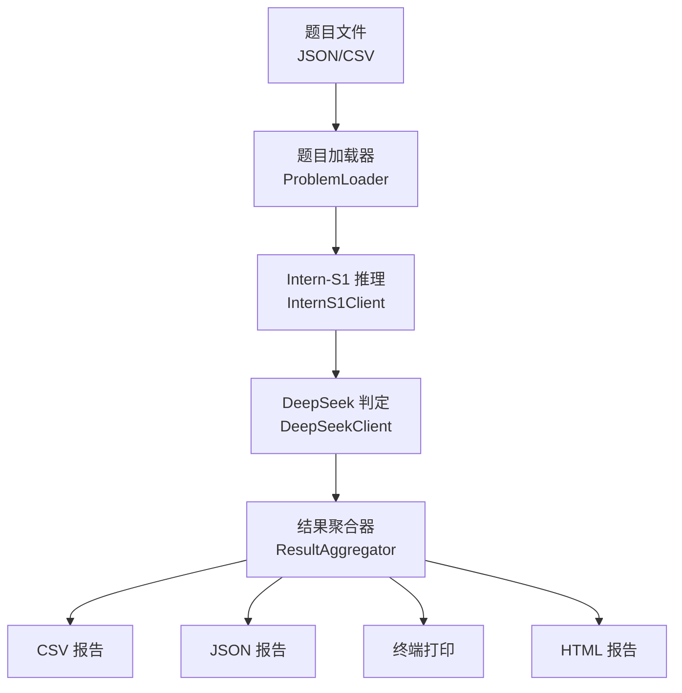

## 产品概述

一个 Python 数学评测器，用于批量评测书生 Intern-S1 模型的数学推理能力。自动读取题目数据，调用 Intern-S1 获取答案和推理过程，再将完整推理链发送给 DeepSeek V4 进行正确性判定，最终汇总生成 CSV/JSON 数据报告、终端摘要打印和 HTML 可视化报告三种输出。

## 核心功能

- **题目加载**：从外部 JSON 或 CSV 文件批量读取数学题目（题目文本 + 标准答案，标准答案可选）
- **Intern-S1 推理**：调用 Intern-S1 API，获取模型的结构化推理结果（答案、推理步骤、验证过程）
- **DeepSeek 判定**：将原题 + Intern-S1 的完整推理过程发送给 DeepSeek V4，由 DeepSeek 判定答案是否正确并给出理由
- **三种报告输出**：生成 CSV/JSON 数据报告、终端实时进度打印、HTML 可视化评测报告

## 技术栈

- **语言**：Python 3.10+
- **HTTP 客户端**：`httpx`（异步支持，带超时和重试）
- **API 调用**：OpenAI 兼容格式（`requests` / `httpx` 直接调用）
- **数据格式**：JSON 输入/输出，CSV 报告
- **HTML 报告**：Jinja2 模板渲染 + 原生 HTML/CSS
- **进度展示**：`tqdm` 进度条
- **配置管理**：`.env` 文件 + `python-dotenv`
- **日志**：Python `logging` 模块

## 实现方案

### 整体策略

采用**管道式处理架构**，将评测流程分为 5 个独立阶段：加载题目 → Intern-S1 推理 → DeepSeek 判定 → 结果汇总 → 报告生成。各阶段通过统一的数据结构（EvaluationResult）串联，便于单独测试和替换任一环节。

### 关键设计决策

1. **API 调用统一抽象为 `LLMClient`**：封装 OpenAI 兼容格式的 HTTP 调用，Intern-S1 和 DeepSeek 共用同一套客户端，仅 endpoint 和 api_key 不同。支持超时、重试、并发控制。
2. **异步并发调用 Intern-S1**：由于 112 道题批量评测耗时较长，Intern-S1 推理阶段使用 `asyncio` + `httpx` 异步并发（可配置并发数），大幅缩短总耗时。
3. **DeepSeek 判定采用同步串行**：避免对 DeepSeek 造成过大压力，同时判定质量要求高于速度。
4. **题目数据结构与比赛 JSON 输出对齐**：Intern-S1 返回的结构化 JSON 直接匹配比赛要求的 `{answer, reasoning, steps, verification}` 格式，评测器也能作为比赛的正式工具使用。
5. **报告生成与评测逻辑分离**：评测核心只产出结构化数据（`List[EvaluationResult]`），报告生成器独立消费该数据，新增报告格式只需新增 Generator 即可。

### 性能考量

- 112 道题 × 30s/题（Intern-S1 推理时间）≈ 串行 56 分钟 → 并发 5 路 ≈ 11 分钟
- DeepSeek 判定约 10s/题，112 题 ≈ 18 分钟
- 总预估：30 分钟完成全量评测
- 通过 tqdm 展示实时进度，避免长时间无反馈

## 架构设计

### 系统架构



### 数据流

1. `ProblemLoader` 从 JSON/CSV 读取题目列表 → `List[Problem]`
2. `InternS1Client` 并发调用 API，获取推理结果 → `List[InferenceResult]`
3. `DeepSeekClient` 逐题判定 → `List[JudgeResult]`
4. `ResultAggregator` 合并为 → `List[EvaluationResult]`
5. `ReportGenerator` 消费 `EvaluationResult` 生成三种报告

### 目录结构

```
d:/挑战杯/
├── evaluation/                    # [NEW] 评测系统根目录
│   ├── __init__.py
│   ├── main.py                    # [NEW] 入口脚本，协调整个评测流程
│   ├── config.py                  # [NEW] 配置管理：API Key、endpoint、并发数等
│   ├── models.py                  # [NEW] 数据模型：Problem, InferenceResult, JudgeResult, EvaluationResult
│   ├── loader.py                  # [NEW] 题目加载器：支持 JSON 和 CSV 格式
│   ├── llm_client.py             # [NEW] LLM 客户端：OpenAI 兼容格式的 HTTP 调用封装
│   ├── intern_s1.py              # [NEW] Intern-S1 推理模块：构造 prompt、解析结构化 JSON 输出
│   ├── deepseek.py               # [NEW] DeepSeek 判定模块：构造判定 prompt、解析判定结果
│   ├── aggregator.py             # [NEW] 结果聚合器：合并推理结果和判定结果
│   ├── reporter.py               # [NEW] 报告生成器：CSV、JSON、终端、HTML 四种输出
│   ├── templates/
│   │   └── report.html           # [NEW] HTML 报告 Jinja2 模板
│   ├── test_cases/
│   │   └── sample_problems.json  # [NEW] 样例题目文件（供测试用）
│   └── reports/                   # [NEW] 报告输出目录（自动创建）
│       └── .gitkeep
├── .env                           # [NEW] 环境变量：INTERN_S1_API_KEY, DEEPSEEK_API_KEY 等
├── .env.example                   # [NEW] 环境变量模板（不含真实 Key）
└── requirements.txt               # [MODIFY] 添加依赖：httpx, python-dotenv, jinja2, tqdm
```

## 实现细节

### 关键数据结构

```python
# models.py 核心类型定义

@dataclass
class Problem:
    """一道数学题"""
    id: str                      # 题目唯一标识
    question: str                # 题目文本（自然语言）
    domain: str | None = None    # 所属子领域（PDE/复分析/拓扑等）
    reference_answer: str | None = None  # 标准答案（可选，用于统计准确率）

@dataclass
class InferenceResult:
    """Intern-S1 推理结果"""
    problem_id: str
    question: str
    answer: str                  # 模型给出的最终答案
    reasoning: str               # 完整推理过程
    steps: list[str]             # 推理步骤列表
    verification: str            # 自验证过程
    raw_response: str            # API 原始返回
    tokens_used: int             # Token 消耗
    latency_seconds: float       # 耗时

@dataclass
class JudgeResult:
    """DeepSeek 判定结果"""
    problem_id: str
    is_correct: bool             # 是否正确
    confidence: float            # 置信度 0-1
    judge_reasoning: str         # 判定理由
    raw_response: str            # API 原始返回
    latency_seconds: float

@dataclass
class EvaluationResult:
    """最终评测结果（合并）"""
    problem_id: str
    question: str
    domain: str | None
    reference_answer: str | None
    model_answer: str
    model_reasoning: str
    is_correct: bool
    judge_confidence: float
    judge_reasoning: str
    inference_latency: float
    judge_latency: float
    total_tokens: int
```

### API 调用设计

- `LLMClient` 统一封装：构造函数接收 `base_url` + `api_key` + `model_name`，提供 `async chat(messages, temperature, max_tokens)` 方法
- Intern-S1 endpoint: `https://api.intern-ai.org.cn/v1/chat/completions`（OpenAI 兼容）
- DeepSeek endpoint: `https://api.deepseek.com/v1/chat/completions`
- 内置重试：最多 3 次，指数退避
- Intern-S1 推理 prompt：要求输出结构化 JSON，包含 `answer`、`reasoning`、`steps`、`verification` 字段
- DeepSeek 判定 prompt：给定原题 + 推理过程，要求输出 `{"is_correct": bool, "confidence": float, "reasoning": str}`

### 错误处理

- API 调用失败：记录日志，标记为失败，不阻塞后续题目
- JSON 解析失败：尝试正则提取 + 重试，仍失败则标记为格式错误
- 网络超时：重试 3 次后跳过该题
- 所有异常均不影响其他题目的评测

### 日志策略

- 使用 Python `logging`，输出到文件 + 终端
- INFO 级别：评测进度、每道题结果摘要
- WARNING 级别：API 重试、JSON 解析回退
- ERROR 级别：API 不可用、题目数据异常

## 使用的 Agent 扩展

### Skill

- **coding**
- 用途：确保代码遵循 Python 最佳实践、SOLID 原则和项目现有架构规范
- 预期产出：高质量的 Python 模块化代码，符合 challenge 杯项目整体架构

- **code-quality**
- 用途：代码审查，确保评测器代码干净、可维护、异常处理完善
- 预期产出：通过代码质量检查的稳健实现

### SubAgent

- **code-explorer**
- 用途：探索 d:\挑战杯\ 下现有文件结构，确认 evaluation/ 目录的准确位置和现有资源
- 预期产出：项目结构确认，确保新建文件路径与现有规划一致