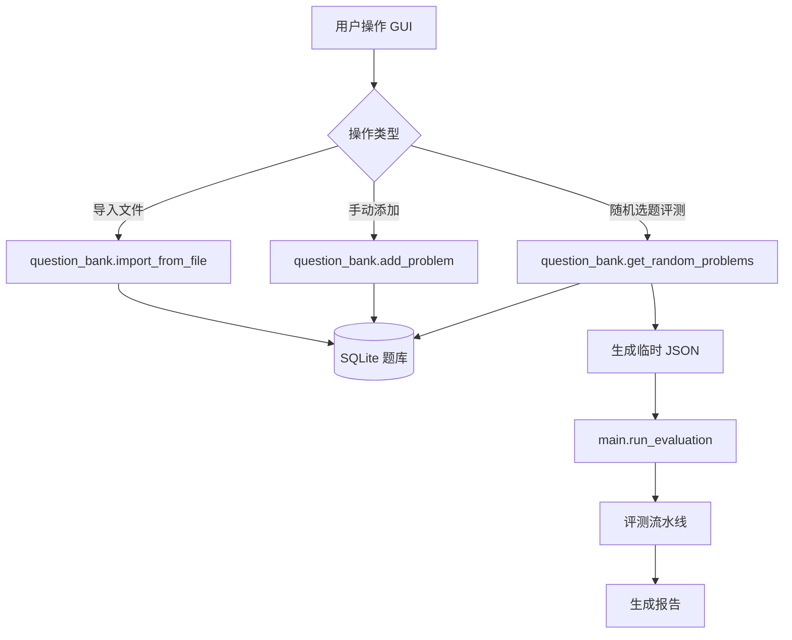

## 用户需求

为现有数学智能体评测器新增题库管理功能，实现题目的持久化存储、管理和随机选题评测。

## 核心功能

1. **题库数据库**：使用 SQLite 存储题目，支持多个题库（按题库名称区分）
2. **创建题库**：新建一个空的题库，用于后续添加题目
3. **导入题目**：从 JSON/CSV 文件批量导入题目到指定题库，复用现有 loader.py 的字段映射能力
4. **手动添加题目**：在 GUI 中手动输入单道题目（ID、题干、领域、参考答案）
5. **随机选题评测**：从指定题库中随机选取指定数量的题目，可选按领域筛选，然后直接进入评测流程
6. **GUI 集成**：在现有 Tkinter 启动器中新增「题库」选项卡，所有题库操作在一个面板中完成

## 技术栈

- **数据库**：SQLite（Python 内置 sqlite3 模块，零配置）
- **GUI 框架**：Tkinter + ttk（与现有 launcher.py 一致）
- **编程语言**：Python 3.x（与现有项目一致）
- **数据库文件**：`测试工具/question_bank.db`

## 实现方案

### 总体策略

新建一个独立的 `question_bank.py` 模块，封装所有题库 CRUD 操作（数据层）。然后修改 `launcher.py` GUI，新增「题库」选项卡面板（展示层），并在 `main.py` 中新增从题库选题并评测的入口（业务层桥接）。

### 数据库设计

题库表 `problems` 结构：

| 字段 | 类型 | 说明 |
| --- | --- | --- |
| id | INTEGER PRIMARY KEY AUTOINCREMENT | 自增主键 |
| problem_id | TEXT NOT NULL | 题目标识（如 "P001"） |
| question | TEXT NOT NULL | 题干 |
| domain | TEXT | 领域/分类 |
| reference_answer | TEXT | 参考答案 |
| bank_name | TEXT NOT NULL | 所属题库名称 |
| created_at | TEXT DEFAULT CURRENT_TIMESTAMP | 添加时间 |

唯一约束：`(problem_id, bank_name)` 联合唯一，同一题库内题目标识不可重复。

### 模块划分

#### 1. question_bank.py（新文件）— 数据层

- `QuestionBankDB` 类：封装 SQLite 连接和所有 CRUD 操作
- 核心方法：
- `init_db()`：建表（自动在首次调用时执行）
- `create_bank(bank_name)`：创建题库（插入一条记录到 banks 表）
- `list_banks()`：列出所有题库名称及题目数量
- `add_problem(problem, bank_name)`：添加单道题目
- `import_from_file(filepath, bank_name)`：从 JSON/CSV 批量导入（复用 loader.load_problems）
- `get_random_problems(bank_name, count, domain_filter=None)`：随机选题
- `get_problem_count(bank_name, domain_filter=None)`：获取题库题目数量
- `delete_bank(bank_name)`：删除整个题库
- `remove_problem(problem_id, bank_name)`：删除单道题目
- 随机选题算法：使用 `ORDER BY RANDOM() LIMIT ?`，支持 WHERE domain 筛选

#### 2. launcher.py（修改）— 展示层

- 新增 `QuestionBankPanel` 类（继承 ttk.Frame），作为题库管理面板
- 主窗口改为 `ttk.Notebook` 选项卡结构：Tab 1「文件评测」（原界面），Tab 2「题库评测」（新界面）
- 题库面板包含：
- 题库下拉列表（选择已有题库）
- 「新建题库」按钮 + 输入框
- 「从文件导入」按钮（调用 filedialog 选择 JSON/CSV）
- 「手动添加」按钮（弹窗输入题目信息）
- 「随机选题评测」区域：数量输入框、领域筛选下拉框、「开始评测」按钮
- 题库统计信息显示（总题数、各领域分布）
- 题目列表浏览（可选，Treeview 展示）

#### 3. main.py（修改）— 业务层

- 新增 `run_evaluation_from_bank(bank_name, count, domain, concurrency)` 函数
- 流程：从题库随机选题 → 生成临时 JSON → 调用现有 `run_evaluation()`

### 数据流

### 与现有架构的关系

- **不影响现有流程**：文件拖放评测流程完全保持不变
- **复用现有模块**：loader.py 的 load_problems() 用于批量导入；main.py 的 run_evaluation() 用于评测；models.py 的 Problem 数据类用于题目传递
- **新增而非修改**：题库功能作为独立模块和独立 GUI 选项卡添加，原有功能零影响

### 性能考量

- SQLite 在本地单机环境下，即使题库有数万道题，`ORDER BY RANDOM()` 也能在毫秒级完成（SQLite 的随机排序针对小数据量优化良好）
- 若未来题库极大（>10万题），可考虑使用 `WHERE rowid >= (abs(random()) % (select max(rowid) from problems))` 的优化方案，当前规模无需
- 批量导入复用 loader.py，单次导入 1000 题约 1-2 秒

### 错误处理

- 数据库操作全部带 try/except，失败时弹出友好错误提示
- 导入文件时校验格式，非法数据跳过并提示用户
- 题库为空时随机选题提示用户先添加题目

## Agent Extensions

### SubAgent

- **code-explorer**
- 用途：在实现过程中快速查找现有代码中的模式、API 调用方式和依赖关系
- 预期结果：确保新增代码与现有项目风格一致，正确复用现有模块