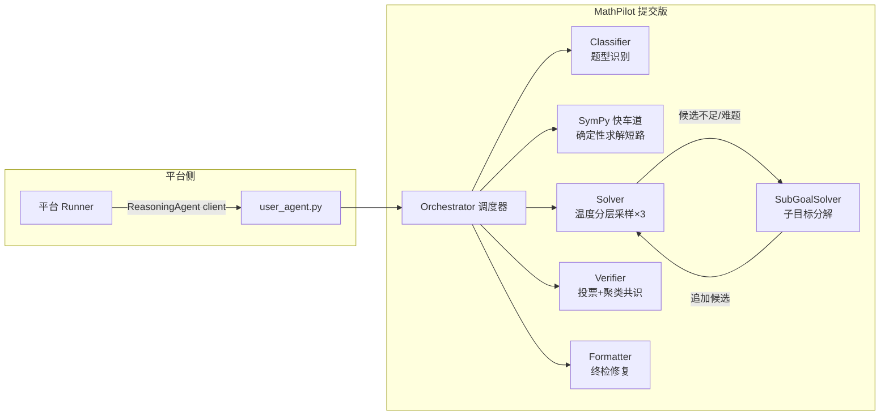

# MathPilot — 基于 Intern-S 系列大模型的数学智能体

> 赛题：基于 Intern-S 系列大模型的数学智能体设计与推理创新（挑战杯人工智能赛道初赛）
>
> 队伍方案：**多智能体协作 + 共享黑板 + 聚类共识投票 + SymPy 符号快车道** 的数学推理智能体

---

## 一、项目简介

MathPilot 接收一道数学题文本与元信息，经过 **题型识别 → 符号快车道 → 多候选求解 → 验证与聚类共识 → 终检格式化** 五阶段流水线，输出最终答案。

与官方 baseline（lagent 双 Agent、无答案提取）相比，本方案的核心差异：

| 维度 | 官方 baseline | MathPilot（本方案） |
|------|--------------|-------------------|
| 架构 | 双 Agent（生成-验证-选择） | 5 智能体流水线（Classifier/Solver/Verifier/Formatter/SubGoalSolver） |
| 答案处理 | 直接输出候选全文 | 多级答案提取 + 6 步规范化 + 终检修复 |
| 共识机制 | 简单投票 | 文本 + SymPy 双路等价聚类，簇置信度 × 规模排序 |
| 确定性求解 | 无 | SymPy 快车道（求导/积分/行列式/方程/极限短路） |
| 异常防护 | 无 | 幻觉检测 / 截断检测 / 模板泄露检测 / 预算控制 / wall-clock 超时 |
| 题型适配 | 无 | 30+ 领域提示词动态增强 + 证明题专用通道 |

---

## 二、接口合规说明（平台硬性要求）

本仓库根目录的 `user_agent.py` 提供平台固定入口：

```python
from user_agent import ReasoningAgent

agent = ReasoningAgent(client=official_client)   # client 由平台注入
result = agent.solve(problem, metadata)          # -> dict
```

返回字典：

```python
{
    "final_response": str,   # 非空最终答案（必含）
    "trace": list,           # 决策轨迹（推荐，可 JSON 序列化）
    "candidates": list,      # 候选解答
    "verdicts": list,        # 验证结果
    "cluster": dict,         # 最优簇信息
}
```

合规要点（已逐项自查）：

- ✅ `ReasoningAgent` 构造函数接受 `client`（`def __init__(self, client, *args, **kwargs)`）
- ✅ `solve(problem: str, metadata: dict) -> dict` 签名与规范一致
- ✅ `final_response` 恒为非空字符串（含全套兜底链路）
- ✅ 返回内容全部可 JSON 序列化（`utils/extract.py::safe_json_serialize`）
- ✅ 不硬编码 API key；`client` 由平台注入，`INTERN_API_KEY` 仅本地调试使用
- ✅ 不依赖绝对路径，所有读取均用相对路径
- ✅ 不依赖标准答案/隐藏测试集
- ✅ 不依赖跨题内存状态（每道题独立进程，仅调用一次 `solve`）

---

## 三、系统架构



### 主流程（单题）

```text
1. 题型识别   元数据携带 domain 时直接复用，否则关键词加权分类（20+ 领域，高权重×3），
              置信度不足时回退 LLM 分类。
2. 快车道     命中求导/积分/行列式/方程/极限等确定性题型 → LLM 提取表达式 → SymPy 直接求解并返回。
3. 求解       温度分层（0.1/0.3/0.5）+ 扰动提示并行生成 3 个候选；失败自动重试；
              证明题走专用通道；候选可完整性续写。
4. 验证       每候选多票投票（拒绝词优先判定），文本规范化 + SymPy 双路等价聚类，
              输出簇置信度与最佳簇。
5. 兜底       全部 0 票或 Solver 无候选时，触发直接求解兜底，保证 final_response 非空。
6. 格式化     聚类加权选最优 → 拒绝语/42 幻觉/截断 LaTeX 终检修复 → 输出。
```

### 安全与资源控制

- **预算控制**：线程安全 `Budget`，单题 LLM 调用 ≤ `max_total_calls`（默认 15，含自纠错 1 轮），防超时超限。
- **wall-clock 超时**：单题 ≤ `max_time_per_question`（默认 300s），Agent 总时长 ≤ 21000s；Windows 下用 `_thread.interrupt_main` 实现。
- **Token 裁剪**：`max_tokens_cap` 截断，上下文超长自动降级重试，TypeError 自动回退 positional 调用。
- **输出质量检测**：幻觉模式（"42 魔法数字"/拒绝回答/AI 身份声明）、截断检测（未闭合 LaTeX/括号/代码块）、模板泄露检测（Intern-S 输出 prompt 模板而非解答）。

---

## 四、目录结构

```text
赛事提交版/
├── user_agent.py              # 平台固定入口：ReasoningAgent + AgentConfig
├── main.py                    # 本地批量 runner（并发 3，逐题原子落盘，断点续跑）
├── run_eval.py                # 本地评测脚本（答案匹配、领域统计、断点续跑）
├── llm_client.py              # InternChatClient（本地调试用 OpenAI 兼容客户端）
├── requirements.txt           # 依赖清单
├── README.md                  # 本文件
├── docs/
│   ├── 技术方案.md            # 答辩材料：架构、创新点、实验数据
│   └── 评测报告.md            # 本地评测汇总
├── agent/                     # 智能体实现
│   ├── base.py                # 数据结构 + BaseAgent + 检测工具
│   ├── classifier.py          # 题型分类器
│   ├── solver.py              # 候选求解器（采样/证明/纠错/兜底）
│   ├── verifier.py            # 验证器（投票/聚类/SymPy 等价）
│   ├── formatter.py           # 输出格式化与终检
│   ├── orchestrator.py        # 调度器（主流程编排）
│   └── sub_goal_solver.py     # 子目标分解求解器
├── prompts/                   # 提示词工程
│   ├── policy.py              # 通用策略 + 蓝图分解 + 30+ 领域提示
│   ├── verifier.py            # 验证提示词
│   ├── revise.py              # 纠错重解提示词
│   ├── proof.py               # 证明题提示词
│   └── sub_goal.py            # 子目标分解提示词
├── utils/
│   ├── extract.py             # 答案提取与规范化
│   ├── sympy_tools.py         # SymPy 安全计算封装
│   └── llm_client.py          # 本地评测用 LLM 客户端
├── tests/                     # 单元测试
├── sample_data/dev.jsonl      # 本地调试样例数据
└── LICENSE
```

---

## 五、本地运行

### 1. 安装依赖

```bash
pip install -r requirements.txt
```

依赖仅两项：`requests>=2.31.0`、`sympy>=1.12`（sympy 可选，缺失时快车道自动降级跳过，不影响主流程）。

### 2. 配置 API Key（仅本地调试需要）

```bash
# Windows PowerShell
$env:INTERN_API_KEY = "sk-..."
# Linux/macOS
export INTERN_API_KEY="sk-..."
```

可选用环境变量覆盖模型与端点：

```bash
export INTERN_MODEL="Intern-S2-Preview-397B"    # 默认即此
export INTERN_API_BASE="https://chat.intern-ai.org.cn/api/v1/chat/completions"
```

### 3. 批量运行（对应平台 runner 行为）

```bash
python main.py --input_file sample_data/dev.jsonl --output_dir sample_outputs
```

- 每道题结果保存为 `sample_outputs/{idx}.json`
- 并发数默认 3，可用 `LOCAL_MAX_CONCURRENCY` 环境变量调整
- 已存在且非空的 `idx.json` 会被跳过（断点续跑）

### 4. 本地评测（答案匹配 + 领域统计）

```bash
python run_eval.py --test_file tests.jsonl --output results.jsonl --concurrency 2
```

- 支持多级答案匹配：字符串 → 分数 → 浮点近似 → SymPy 符号等价
- 输出领域细分正确率与平均耗时
- `--resume` 支持断点续跑

### 5. 冒烟测试

```bash
python -m pytest tests/ -q          # 若使用 pytest
python tests/test_runner_contract.py # 或直接运行 unittest 风格测试
```

---

## 六、核心配置说明（AgentConfig）

配置集中在 `user_agent.py::AgentConfig`，平台评测使用默认值，本地实验可通过 `ReasoningAgent(client, **kwargs)` 覆盖。

| 配置项 | 默认值 | 说明 |
|--------|--------|------|
| `policy_sample_times` | 3 | 候选解答数量 |
| `policy_temperature` | 0.3 | 策略采样温度 |
| `verifier_voting_times` | 1 | 每个候选验证票数 |
| `by_enable_fast_path` | True | SymPy 快车道开关 |
| `max_total_calls` | 15 | 单题 LLM 调用预算硬上限 |
| `max_time_per_question` | 300 | 单题壁钟时间上限（秒） |
| `max_total_time_seconds` | 21000 | Agent 总时长上限（秒，=6h） |
| `use_scoring` | False | 验证器多维评分模式 |
| `use_proof_channel` | False | 证明题专用通道 |
| `max_revise_rounds` | 1 | 自纠错回环轮数（A/B 合入） |
| `use_blueprint` | False | 蓝图分解（已简化为直解） |
| `use_sub_goal` | False | 子目标分解（候选不足 2 或证明题触发） |

> A/B 验证结论（2026-08-13，6 题本地集）：
> - `max_revise_rounds=1`：6/6 无损失、输出更易读 → **已合入默认**（自纠错轮数改为 1）；
> - `verifier_voting_times=3`：准确率无增量、耗时 +23% → 保持 1 票；
> - `use_blueprint`：掉分且耗时 +165% → 保持关闭；
> - `use_scoring` + `use_proof_channel`：6/6 但耗时 +163%（267.3s）→ 保持关闭（无性价比）；
> - `use_sub_goal`：已接入（候选不足 2 或证明题触发），默认关闭可随时开启。
> 其余能力默认关闭，是为在**平台限流（RPM 30 / TPM 150000）与 6 小时总时限**下保证稳定性。

---

## 七、评测规则适配（自查清单）

| 规则 | 适配情况 |
|------|---------|
| 并发 = 3（独立题目进程） | `max_workers=3`，验证线程并发安全（`Budget` 用 RLock） |
| 单题进程组硬时限 1200s | 单题默认 300s 预算，远低于硬限 |
| Agent 总硬时限 6h（21000s） | `max_total_time_seconds=21000`，预算与壁钟双控 |
| RPM 30 / TPM 150000 | 单题 ≤15 次 LLM 调用、token 裁剪，规避限流 |
| 逐题独立进程、仅调一次 solve | `main.py` 模拟；不依赖跨题状态 |
| final_response 非空 | 四层兜底链路保证 |
| 不可硬编码 key / 绝对路径 | 已自查通过 |

---

## 八、创新点总结

1. **多智能体协作 + 共享黑板**：5 个专职 Agent 通过 `TaskContext` 黑板读写同一上下文，全程 trace 可追溯。
2. **聚类共识投票**：候选答案经文本 + SymPy 双路等价归一化为簇，以簇置信度 × 规模排序选最优，抗单点噪声。
3. **SymPy 符号快车道**：确定性题型（求导/积分/行列式/方程/极限）由 LLM 提取表达式、符号引擎精确求解，零推理误差。
4. **提示词工程**：30+ 数学领域动态提示词 + 蓝图分解（可按需开启）+ 证明/纠错/子目标专用提示词。
5. **输出质量防护**：幻觉检测、截断检测、模板泄露检测（Intern-S 特有）、英文思考链污染检测。
6. **资源自控**：LLM 预算 + wall-clock 超时 + Token 裁剪 + 并发安全，适配竞赛限流与时限。

---

## 九、提交前检查（checklist）

- [ ] `user_agent.py` 可被正常 import
- [ ] `ReasoningAgent(client=official_client)` 可正常初始化
- [ ] `solve(problem, metadata)` 返回含非空 `final_response` 的 JSON 可序列化字典
- [ ] `requirements.txt` 覆盖全部依赖
- [ ] 无硬编码 API key、个人路径、调试标准答案
- [ ] `main.py --input_file sample_data/dev.jsonl --output_dir sample_outputs` 本地跑通
- [ ] 选择使用的模型：`Intern-S2-Preview-397B`

---

## 十、致谢与参考

- 官方 baseline 仓库（接口规范与本地 runner）
- 书生 Intern API 控制台（模型与限流申请）
