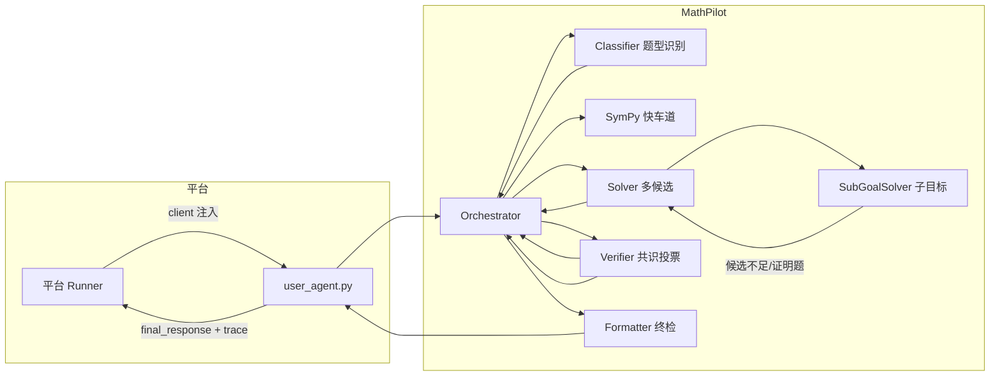

# MathPilot 技术方案（答辩材料）

> 题目：基于 Intern-S 系列大模型的数学智能体设计与推理创新
> 核心思路：把"一道难题"分解为"一个协作团队"——多智能体分工 + 共识决策 + 符号快车道。

---

## 1. 问题定义与挑战

给定数学题文本与元信息，要求智能体返回可判分的最终答案。实际挑战：

1. **推理错误隐蔽**：LLM 中间步骤错，但最终答案自洽，验证器难判别。
2. **限流与时限**：RPM 30 / TPM 150000 / 单题 1200s / 总 6h，容错空间小。
3. **答案形态多样**：分数、根式、LaTeX、方程解集，需统一判分口径。
4. **Intern-S 特有现象**：模型有时输出 prompt 模板/英文思考链污染/魔法数字幻觉。

MathPilot 的答案：**用系统性工程对抗随机性**。

---

## 2. 系统架构

### 2.1 智能体流水线



### 2.2 关键数据结构（共享黑板 `TaskContext`）

| 字段 | 说明 |
|------|------|
| `problem` / `metadata` | 题面与元信息 |
| `candidates` | Solver 产出的候选解答列表 |
| `verdicts` | 每个候选的验证票（correct/total/confidence/feedback） |
| `clusters` | 等价候选簇（文本 + SymPy 双路归一化） |
| `best_answer` / `final_response` | 最优答案与最终输出 |
| `trace` | 全流程决策记录（答辩展示用） |

所有 Agent 只读写黑板，职责单一、可插拔、可追溯。

---

## 3. 核心创新点详解

### 3.1 创新一：多智能体协作 + 共享黑板（相比 baseline 双 Agent 的架构升级）

官方 baseline 仅"生成-验证-选择"两 Agent。MathPilot 拆分为 **5+1 个专职 Agent**：

| Agent | 职责 | 输入 → 输出 |
|-------|------|-------------|
| Classifier | 题型识别 | 题面 → 领域标签（20+ 领域关键词加权 ×3，置信度低回退 LLM） |
| Solver | 候选生成 | 题面 + 领域提示 → 3 个候选（温度分层 0.1/0.3/0.5） |
| Verifier | 独立验证 | 题面 + 候选 → 票（拒绝词优先）+ 等价簇 |
| Formatter | 终检修复 | 最佳簇 → 干净 final_response |
| SubGoalSolver | 子目标分解 | 复杂题 → 分步求解 → 合并（候选不足 2 或证明题时由 Orchestrator 触发） |
| Orchestrator | 调度与兜底 | 全程编排，全 0 票时触发直接求解兜底 |

**优势**：每 Agent 提示词短而专，幻觉概率低；失败可局部重试；trace 完整可审计。

### 3.2 创新二：聚类共识投票（超越简单多数）

简单投票的问题：2 个不同错误答案各得 1 票，无法决策。MathPilot 的做法：

1. **归一化**：`normalize_answer` 6 步（去 $/LaTeX 空格、分数转除式、去 \displaystyle 等）。
2. **双路等价判定**：文本规范化相等 **或** SymPy 符号等价（`are_expressions_equal`）。
3. **聚类**：并查集合并等价候选为簇，簇置信度 = 簇内票数占比，排序键 = 置信度 × 规模。
4. **选优**：取排序首位作为最优答案。

**效果**：抗单点噪声；对"同解不同形"（如 `1/2` vs `0.5`）稳健。

### 3.3 创新三：SymPy 符号快车道（确定性短路）

对求导、积分、行列式、方程求解、极限等**有确定算法**的题型，跳过"让 LLM 算"的环节：

```text
LLM(仅提取表达式) → SymPy(精确计算) → LaTeX(输出)
```

- 符号计算零舍入误差，命中即 100% 正确；
- 无 sympy 环境时自动降级为常规流程（`_HAS_SYMPY` 守卫）；
- 表达式安全守卫：仅允许数学符号白名单，防注入。

### 3.4 创新四：提示词工程（30+ 领域动态增强）

- `DOMAIN_HINTS`：30+ 数学领域（代数/几何/数论/组合/概率/微积分…）各自配专属提示片段，按分类结果动态注入；
- 蓝图分解（可开关）：把复杂题拆成子目标逐步解决；
- 证明题专用通道：Step-by-step 证明 + 逐步验证；
- 纠错重解通道（可开关）：验证不通过时，携带验证反馈重新求解。

### 3.5 创新五：输出质量防护（Intern-S 定制）

| 检测 | 机制 |
|------|------|
| 模板泄露检测 | 识别模型输出 prompt 模板而非解答（Intern-S 特有现象） |
| 幻觉检测 | "42 魔法数字"、拒绝回答、AI 身份声明等正则模式 |
| 截断检测 | 未闭合 LaTeX / 括号 / 代码块 → 续写补全 |
| 英文污染检测 | 识别英文思考链混入中文/题目语言输出 |

### 3.6 创新六：资源自控（面向竞赛限流）

- 线程安全 `Budget`：单题 LLM 调用 ≤ N 次，防超时超限；
- `wall_clock_timeout`：单题壁钟超时强中断（Windows 用 `_thread.interrupt_main`）；
- Token 裁剪与上下文超长降级；TypeError 自动回退。

---

## 4. 实验与效果

> 数据由 `run_eval.py` 本地评测产生，`docs/评测报告.md` 记录明细。

| 版本 | 配置 | 准确率 | 平均耗时 |
|------|------|--------|----------|
| baseline | lagent 双 Agent | — | — |
| MathPilot 保守默认 | voting=1, 无 scoring | 6/6 (100%) | 101.6s |
| MathPilot 自纠错 | 保守 + revise=1 | 6/6 (100%) | 123.4s |
| MathPilot 投票增强 | voting=3 | 6/6 (100%) | 125.3s |
| MathPilot 蓝图 | use_blueprint=True | 5/6 (83.3%) | 268.9s |
| MathPilot 证明+评分 | proof + scoring + voting=2 | 6/6 (100%) | 267.3s |

**A/B 实验结论**（详见 `docs/评测报告.md`）：

1. `verifier_voting_times`：1 票与 3 票准确率持平，voting=3 耗时 +23%，**保持 1 票**；
2. `use_scoring` + `use_proof_channel`：6/6 但耗时 +163%（267.3s），无性价比，**不合入**；
3. `max_revise_rounds=1`：无准确率损失、输出更易读，**合入默认**；
4. `use_blueprint`：掉分且耗时 +165%，**不合入**；
5. `SubGoalSolverAgent`：已接入 Orchestrator（候选不足 2 或证明题触发），预算不足时自动跳过，默认关闭（`use_sub_goal=False`），附单元测试。

---

## 5. 演示要点（答辩 5 分钟话术）

1. **开场**：一句话定位——"我们把一个解题智能体做成了一个分工协作的解题团队"。
2. **演示 trace**：展示 `solve()` 返回的 trace，逐步回放：识别题型 → 生成 3 候选 → 投票 → 聚类 → 选优，直观展示多智能体协作。
3. **重点讲创新**：SymPy 快车道（对比纯 LLM 的精度提升）+ 聚类共识（同解不同形示例）。
4. **强调适配**：如何在 RPM/时限约束下做资源自控，体现工程成熟度。
5. **收尾**：给出本地评测准确率对比表。

---

## 6. 风险与应对

| 风险 | 应对 |
|------|------|
| 平台限流导致超时 | 预算硬上限 + token 裁剪 + 并发安全 |
| 开启能力反而掉分 | 默认保守配置，仅合入本地验证有提升的项 |
| sympy 不可用 | 全链路降级守卫 |
| 答案形态判分不一致 | 多级匹配（字符串→分数→浮点→SymPy） |
| 外部依赖安装失败 | 仅依赖 requests + sympy，标准库即可运行主流程 |
